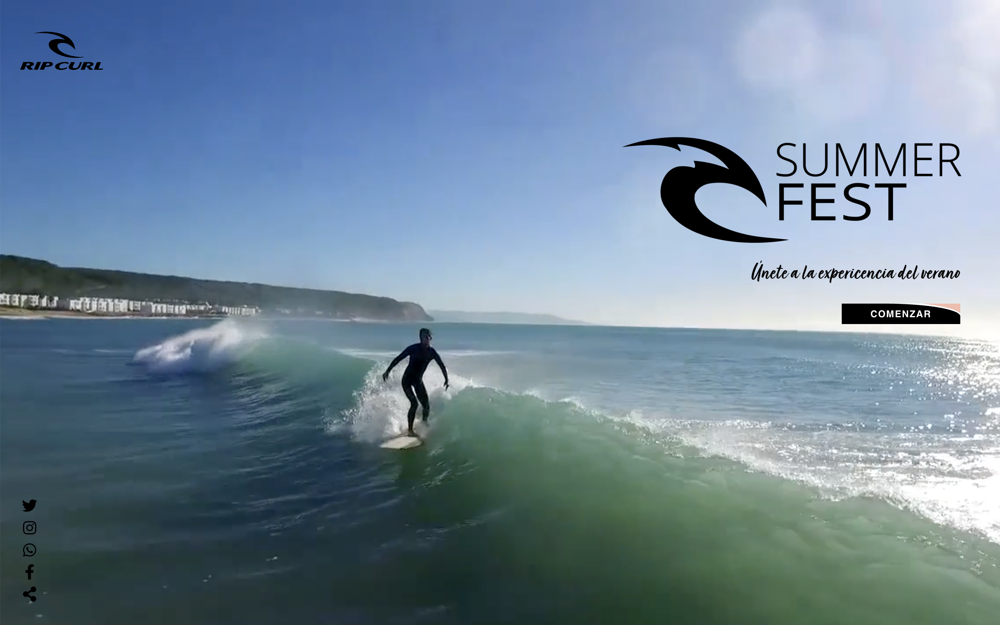

# Festival--microsite

## Ejemplo en vivo

- [Ver página](https://deletidev.github.io/festival--microsite/multimedia.html)

## Descripción 📑

Microsite de un festival ficticio, para ofrecer información y promocionar el festival de temática surf.

## ¿Qué he aprendido en este proyecto? 🙇🏻

Con el aprendí poner un vídeo de fondo y que se vea en todos los dispositivos, a asimilar y ver todas las posibilidades de la propiedad flex de CSS, y ha realizar cosas simples con Javascript, y a usar recursos ya creados en JQuery.

Actualmente sé que habría muchas cosas modificables, pero para lo que había estudiado está muy bien, y es un ejemplo para ver mi evolución.

## Tecnologías 🛠

<!-- Iconos sacados de: https://github.com/hendrasob/badges/blob/master/README.md y https://github.com/alexandresanlim/Badges4-README.md-Profile -->

## Autor ✒️

**Leticia de la Osa**

- [contacto@deletidev.com](mailto:contacto@deletidev.com)
- [LinkedIn](https://www.linkedin.com/in/deletidev)
- [Mi porfolio web](https://deletidev.com/)

## Instalación

Este proyecto no necesita instalación.

## Licencia 📄

MIT Public License v3.0
No puede usarse comercialmente.
